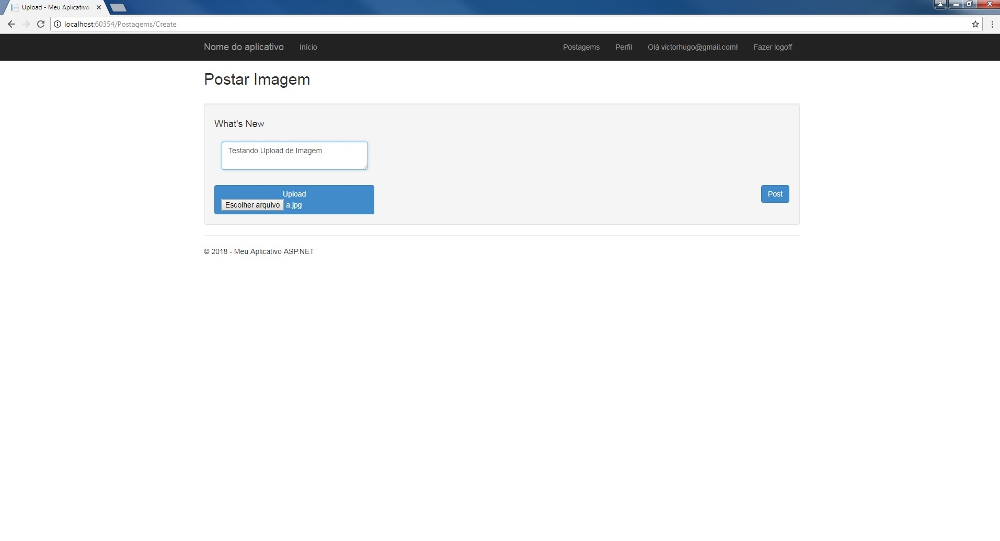

# Projeto da faculdade Infnet utilizando C# para avaliar as competências dos alunos.  
#### Descrição do Sistema.  
O software completo desenvolvido deve ser composto por, pelo menos, uma camada de serviços, que deve ser representada por um projeto ASP.NET Web API, e uma camada de apresentação, que deve ser representada por um projeto ASP.NET MVC. Nele devem conter as funcionalidade de criação, gerenciamento de contas e acesso ao sistema, criação, visualização e edição de um perfil para o usuário, criação, visualização e gerenciamento da galeria de mídias do usuário. Todas as operações do sistema devem ser realizadas através da aplicação ASP.NET Web API, sendo assim, a aplicação ASP.NET MVC é apenas um cliente e não deve conter lógica de negócio, apenas consumir a API.

#### Imagens do Sistema.

